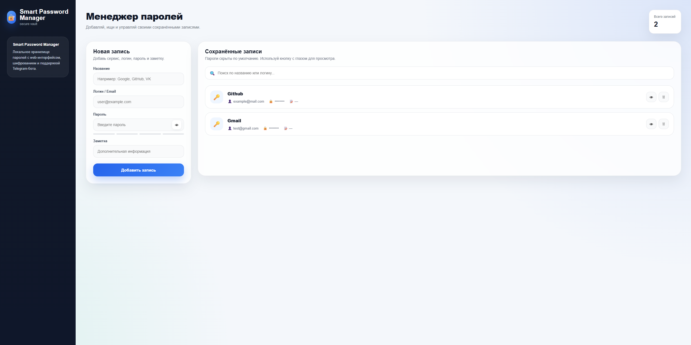
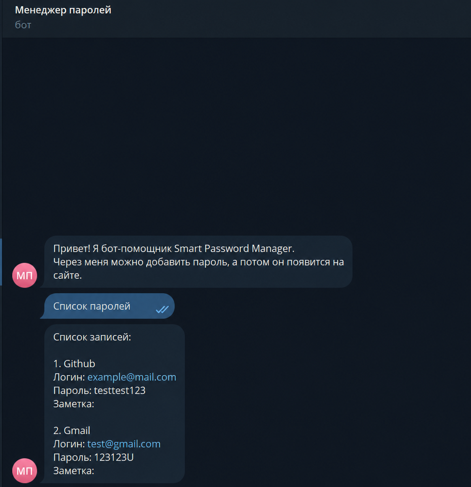

# Smart Password Manager

Smart Password Manager is an educational password manager built with Python, Flask, JavaScript and Telegram Bot API.

The project demonstrates basic object-oriented programming principles, encrypted data storage, REST API usage and integration between a web interface and a Telegram bot.

> This project was created as part of an Object-Oriented Programming coursework.

## Features

* add password entries with service name, username, password and note;
* view saved password entries;
* search entries by service name or username;
* hide and show passwords in the web interface;
* delete saved entries;
* add and view entries through a Telegram bot;
* store data in encrypted form using Fernet encryption;
* use a single Flask API for both Web UI and Telegram Bot;
* console-based backup subsystem for encrypted vault files.

## Tech Stack

* Python
* Flask
* HTML
* CSS
* JavaScript
* Fetch API
* pyTelegramBotAPI
* requests
* cryptography / Fernet
* Git / GitHub
* Docker
* Docker Compose


## Architecture

The application uses a single Flask API as the central backend layer.

```text
Web UI        → Flask API → Vault → CryptoEngine → vault.enc
Telegram Bot  → Flask API → Vault → CryptoEngine → vault.enc
```

## Screenshots

### Web Interface



### Telegram Bot



## Installation

Clone the repository:

```bash
git clone https://github.com/YOUR_USERNAME/smart-password-manager.git
cd smart-password-manager
```

Create a virtual environment:

```bash
python -m venv .venv
```

Activate the virtual environment on Windows:

```bash
.venv\Scripts\activate
```

Install dependencies:

```bash
pip install -r requirements.txt
```

## Environment Variables

Create a `.env` file in the project root:

```env
BOT_TOKEN=your_telegram_bot_token_here
API_URL=http://127.0.0.1:5000
```

The `.env` file is ignored by Git and should not be uploaded to GitHub.

## Running with Docker

The project can be started with Docker Compose. This will run two services:

* `web` — Flask API and web interface;
* `bot` — Telegram bot.

Before running the project, create a `.env` file in the project root based on `.env.example`:

```env
BOT_TOKEN=your_telegram_bot_token_here
API_URL=http://127.0.0.1:5000
MASTER_KEY_PATH=data/master.key
VAULT_PATH=data/vault.enc
```

For Docker Compose, the bot uses the internal service URL:

```env
API_URL=http://web:5000
```

The encrypted vault files are stored in the local `data/` directory:

```text
data/
├── master.key
└── vault.enc
```

These files are not included in the repository.

To build and start the project, run:

```bash
docker compose up --build
```

After startup, the web interface will be available at:

```text
http://127.0.0.1:5000
```

To stop the containers, press:

```text
Ctrl + C
```

Or run:

```bash
docker compose down
```


## Running the Project

Start the Flask API:

```bash
python api_server.py
```

Open the web interface:

```text
http://127.0.0.1:5000
```

In a separate terminal, start the Telegram bot:

```bash
python TG_BOT.py
```

## Backup Subsystem

The project includes a separate console-based backup subsystem.

The backup client sends the encrypted `vault.enc` file to the backup server. This functionality is currently not integrated into the web interface or Telegram bot.
